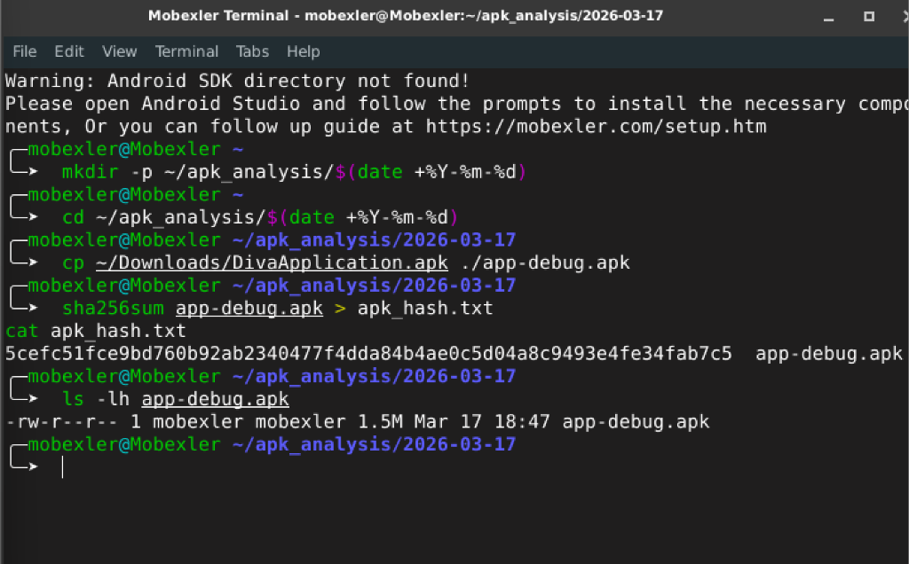
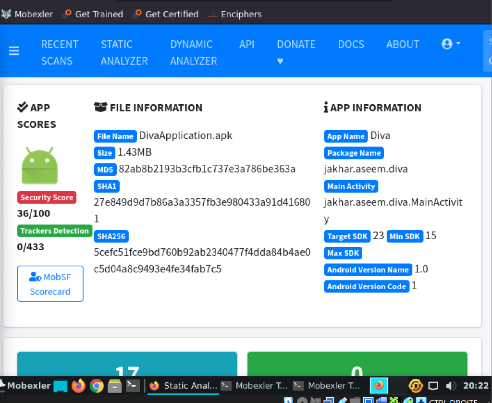
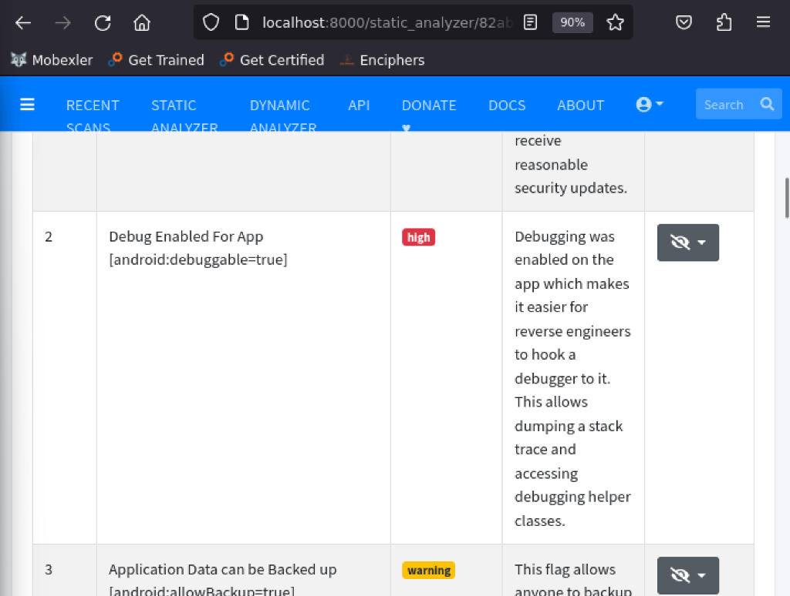
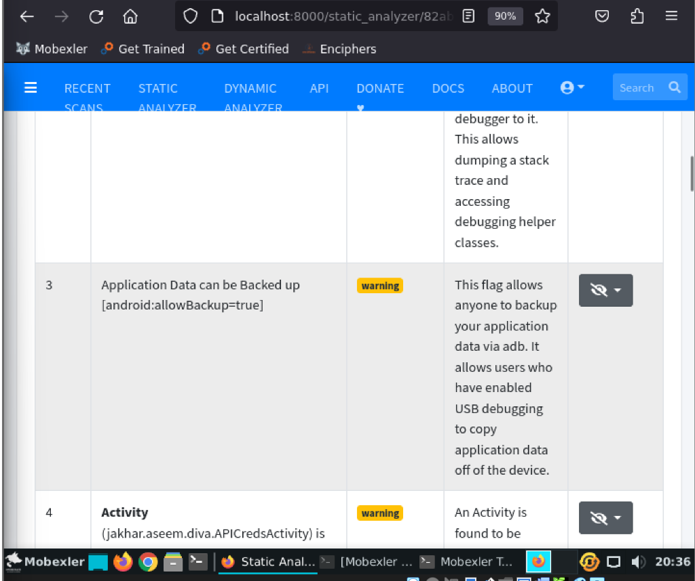
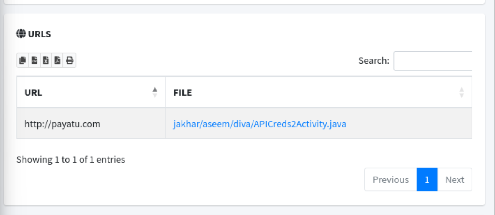
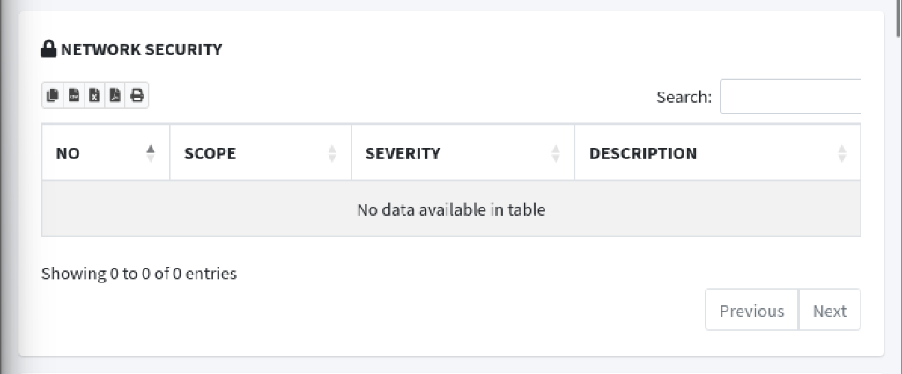
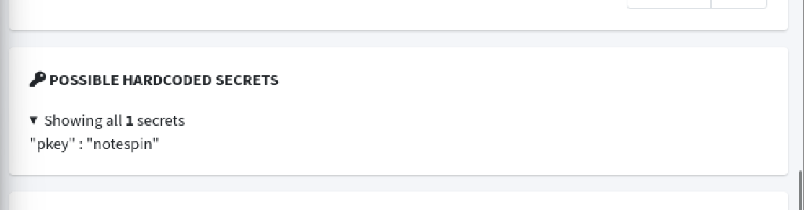

# 🔬 LAB 6 — Analyse Statique d'un APK avec MobSF dans la VM Mobexler

## 📋 Description

Ce laboratoire a pour objectif de réaliser une **analyse statique complète** d'une application Android (APK) à l'aide de l'outil **MobSF (Mobile Security Framework)**, exécuté dans la machine virtuelle **Mobexler**. L'APK cible utilisé est **DIVA (Damn Insecure and Vulnerable App)**, une application volontairement vulnérable conçue à des fins éducatives.

L'analyse statique permet d'inspecter le code source, les permissions, les composants et les configurations d'une application **sans l'exécuter**, afin d'identifier des failles de sécurité potentielles.

---

## 🛠️ Outils Utilisés

| Outil | Rôle |
|-------|------|
| **Mobexler VM** | Environnement d'audit mobile pré-configuré |
| **MobSF** | Framework d'analyse de sécurité mobile (statique & dynamique) |
| **DivaApplication.apk** | Application Android vulnérable utilisée comme cible |
| **sha256sum** | Utilitaire de vérification d'intégrité par empreinte cryptographique |

---

## 📂 Étapes du Laboratoire

---

### 🔐 Étape 1 : Préparation & Vérification de l'Intégrité

**🎯 Objectif :** Garantir que l'APK analysé est **authentique et non corrompu** avant de procéder à l'analyse statique.

Avant toute analyse, il est essentiel de vérifier l'intégrité du fichier APK. Cette vérification repose sur le calcul d'une **empreinte cryptographique SHA-256**. Si le hash correspond à celui attendu, cela confirme que le fichier n'a pas été altéré pendant le téléchargement ou le transfert.

#### 📝 Commandes exécutées :

```bash
# 1. Création de l'arborescence du projet avec la date système
mkdir -p ~/apk_analysis/$(date +%Y-%m-%d)

# 2. Accès au répertoire de travail
cd ~/apk_analysis/$(date +%Y-%m-%d)

# 3. Copie de l'APK depuis le dossier Downloads vers le répertoire d'audit
cp ~/Downloads/DivaApplication.apk ./app-debug.apk

# 4. Calcul de l'empreinte numérique SHA-256 (Fingerprint)
# Cette étape est cruciale pour prouver l'intégrité de l'échantillon
sha256sum app-debug.apk > apk_hash.txt

# 5. Affichage du Hash pour vérification
cat apk_hash.txt
```

#### 📊 Résultat obtenu :

```
5cefc51fce9bd760b92ab2340477f4dda84b4ae0c5d04a8c9493e4fe34fab7c5   app-debug.apk
```

> **✅ Interprétation :** Le hash SHA-256 a été calculé avec succès. Cette empreinte unique permet de confirmer l'intégrité du fichier APK. Toute modification du fichier, même d'un seul octet, produirait un hash complètement différent, garantissant ainsi la fiabilité de l'échantillon analysé.

#### 📸 Capture d'écran :



---

### 🚀 Étape 2 : Lancement & Analyse Statique avec MobSF

**🎯 Objectif :** Déployer l'instance MobSF et procéder à la **rétro-ingénierie automatisée** de l'APK cible.

MobSF (Mobile Security Framework) est un outil open-source capable de réaliser automatiquement une analyse statique complète d'un APK. Il décompile l'application, extrait les métadonnées, identifie les permissions dangereuses, et attribue un **score de sécurité** global.

#### 📝 Commandes exécutées :

```bash
# Lancement du conteneur Docker dédié à MobSF
# Le script vérifie si le port 8000 est déjà utilisé avant de démarrer
/home/mobexler/AndroidZone/MobSFdocker.sh

# Vérification du statut du conteneur Docker
docker ps
```

#### 🔧 Procédure d'utilisation :

1. **Navigation** vers l'interface web : `http://localhost:8000`
2. **Authentification** avec les identifiants par défaut : `mobsf / mobsf`
3. **Upload** du fichier `app-debug.apk` depuis `~/apk_analysis/2026-03-17/`
4. **Lancement automatique** de l'analyse statique par MobSF

#### 📊 Résultats du Dashboard MobSF :

| Catégorie | Détail |
|-----------|--------|
| **Security Score** | **36/100** ⚠️ (Score faible, indiquant de nombreuses vulnérabilités) |
| **Trackers Detection** | 0/433 |
| **File Name** | DivaApplication.apk |
| **Size** | 1.43 MB |
| **App Name** | Diva |
| **Package Name** | `jakhar.aseem.diva` |
| **Main Activity** | `jakhar.aseem.diva.MainActivity` |
| **Target SDK** | 23 |
| **Min SDK** | 15 |
| **Android Version Name** | 1.0 |
| **Android Version Code** | 1 |

#### 🔑 Empreintes cryptographiques détectées :

| Algorithme | Hash |
|------------|------|
| **MD5** | `82ab8b2193b3cfb1c737e3a786be363a` |
| **SHA1** | `27e849d9d7b86a3a3357fb3e980433a91d416801` |
| **SHA256** | `5cefc51fce9bd760b92ab2340477f4dda84b4ae0c5d04a8c9493e4fe34fab7c5` |

> **✅ Interprétation :** Le score de sécurité de **36/100** est très faible, ce qui est attendu pour DIVA, une application intentionnellement vulnérable. Le hash SHA-256 affiché par MobSF correspond exactement à celui calculé manuellement à l'Étape 1, confirmant ainsi que le fichier analysé est bien le même que celui vérifié initialement. L'absence de trackers (0/433) indique que l'application ne contient pas de bibliothèques de suivi tierces.

#### 📸 Capture d'écran :



---

### 📜 Étape 3 : Analyse du Manifeste (Vulnérabilités Système)

**🎯 Objectif :** Analyser le fichier `AndroidManifest.xml` pour identifier les **privilèges excessifs** et les configurations dangereuses.

Le fichier `AndroidManifest.xml` est le cœur de toute application Android. Il déclare les composants de l'application (activités, services, récepteurs, fournisseurs de contenu), les permissions requises, ainsi que les configurations de sécurité. MobSF analyse automatiquement ce fichier et signale les configurations à risque.

#### 🔍 Vulnérabilités identifiées :

| # | Vulnérabilité | Sévérité | Description |
|---|---------------|----------|-------------|
| 2 | **Debug Enabled For App** `[android:debuggable=true]` | 🔴 **High** | Le débogage est activé sur l'application, ce qui facilite le travail des rétro-ingénieurs pour attacher un débogueur. Cela permet le dump de la pile d'exécution (stack trace) et l'accès aux classes d'aide au débogage. |
| 3 | **Application Data can be Backed up** `[android:allowBackup=true]` | 🟡 **Warning** | Ce flag permet à n'importe qui de sauvegarder les données de l'application via `adb backup`. Les utilisateurs ayant activé le débogage USB peuvent copier les données de l'application hors de l'appareil. |
| 4 | **Activity Exported** `(jakhar.aseem.diva.APICredsActivity)` | 🟡 **Warning** | Une activité est exportée et accessible par d'autres applications, ce qui peut exposer des fonctionnalités sensibles. |

#### ⚠️ Analyse détaillée des risques :

**1. `android:debuggable=true` (Risque élevé 🔴)**
- **Impact :** Un attaquant peut attacher un débogueur (comme `jdb` ou Android Studio) à l'application en cours d'exécution
- **Conséquence :** Accès complet au flux d'exécution, aux variables en mémoire, et possibilité d'injection de code en temps réel
- **Recommandation :** Ce flag doit **impérativement** être défini sur `false` en production

**2. `android:allowBackup=true` (Risque moyen 🟡)**
- **Impact :** Un utilisateur ou un attaquant avec un accès physique peut extraire toutes les données de l'application via la commande `adb backup`
- **Conséquence :** Fuite de données sensibles (identifiants, tokens, bases de données locales)
- **Recommandation :** Définir `android:allowBackup="false"` ou implémenter un `BackupAgent` personnalisé

> **✅ Interprétation :** Le manifeste de DIVA révèle des configurations de sécurité dangereuses qui sont malheureusement courantes dans de nombreuses applications réelles. Le flag `debuggable=true` est la vulnérabilité la plus critique car elle ouvre la porte à l'injection de code et à l'inspection en temps réel de l'application. Combiné au flag `allowBackup=true`, cela crée un vecteur d'attaque permettant à la fois l'extraction de données et la modification du comportement de l'application.

#### 📸 Captures d'écran :





---

### 🌐 Étape 4 : Analyse Network Security

**🎯 Objectif :** Identifier les **failles de communication réseau** et l'absence de chiffrement TLS dans l'application.

La sécurité réseau est un pilier fondamental de la protection des données en transit. Android permet aux développeurs de définir une **Network Security Configuration** pour contrôler les politiques de connexion (TLS, certificats épinglés, domaines autorisés). L'absence de cette configuration expose l'application à des attaques de type **Man-in-the-Middle (MitM)**.

#### 🔍 Constats de l'analyse :

**1. Absence de Network Security Configuration**

| Champ | Valeur |
|-------|--------|
| **NO** | — |
| **SCOPE** | — |
| **SEVERITY** | — |
| **DESCRIPTION** | *No data available in table* |

> L'application **ne définit aucune politique de sécurité réseau**. Cela signifie qu'elle utilise les paramètres par défaut d'Android, qui varient selon la version du SDK cible. Avec un **Target SDK 23** (Android 6.0), le trafic en clair (HTTP) est autorisé par défaut.

**2. URLs détectées dans le code source**

| URL | Fichier Source |
|-----|----------------|
| `http://payatu.com` | `jakhar/aseem/diva/APICreds2Activity.java` |

#### ⚠️ Analyse des risques réseau :

- **Protocole HTTP en clair :** L'URL `http://payatu.com` utilise le protocole HTTP **non chiffré**, ce qui signifie que toutes les données échangées transitent en clair sur le réseau
- **Absence de Certificate Pinning :** Aucun mécanisme d'épinglage de certificat n'est implémenté, rendant l'application vulnérable aux attaques MitM avec des certificats frauduleux
- **Pas de Network Security Config :** L'absence de fichier `network_security_config.xml` empêche toute restriction des communications réseau

#### 🛡️ Recommandations :

1. **Migrer vers HTTPS** pour toutes les communications réseau
2. **Implémenter une Network Security Configuration** avec `cleartextTrafficPermitted="false"`
3. **Ajouter du Certificate Pinning** pour les domaines critiques
4. **Définir un Target SDK ≥ 28** (Android 9+) qui bloque le trafic en clair par défaut

> **✅ Interprétation :** L'absence totale de configuration de sécurité réseau, combinée à l'utilisation d'URLs en HTTP non chiffré, expose l'application à des interceptions de données en transit. Un attaquant sur le même réseau pourrait facilement capturer les requêtes envoyées vers `http://payatu.com` et voler des identifiants API ou d'autres données sensibles.

#### 📸 Captures d'écran :





---

### 🔑 Étape 5 : Recherche de Secrets Hardcodés

**🎯 Objectif :** Localiser les **constantes sensibles** (clés, tokens, mots de passe) intégrées directement dans le code source de l'application.

Le hardcoding de secrets dans le code source est l'une des erreurs de sécurité les plus critiques et les plus courantes en développement mobile. Toute clé, mot de passe ou token stocké en dur dans le code peut être extrait par simple décompilation de l'APK, compromettant ainsi la sécurité de l'ensemble du système.

#### 🔍 Secret identifié par MobSF :

| Clé | Valeur | Fichier |
|-----|--------|---------|
| `"pkey"` | `"notespin"` | Code source décompilé |

> **🔴 Nombre total de secrets détectés : 1**

#### ⚠️ Analyse du risque :

**Nature du secret :**
- Le nom `pkey` suggère qu'il s'agit d'une **clé privée** ou d'une **clé de chiffrement** utilisée par l'application
- La valeur `notespin` est utilisée comme clé cryptographique pour les opérations de chiffrement/déchiffrement des notes de l'application

**Impact de la compromission :**
- **Déchiffrement de toutes les données :** Un attaquant connaissant cette clé peut déchiffrer toutes les données protégées par l'application
- **Compromission totale :** Les fonctions cryptographiques de l'application sont entièrement compromises car la clé est publiquement accessible
- **Attaque reproductible :** Puisque la clé est statique et identique pour toutes les installations, chaque utilisateur de l'application est vulnérable

#### 🛡️ Recommandations :

1. **Ne jamais stocker de clés en dur** dans le code source
2. **Utiliser Android Keystore** pour générer et stocker les clés cryptographiques de manière sécurisée
3. **Dériver les clés** à partir d'un mot de passe utilisateur avec un algorithme comme **PBKDF2** ou **Argon2**
4. **Utiliser des variables d'environnement** ou un **serveur de gestion de secrets** pour les clés d'API

> **✅ Interprétation :** La découverte du couple `pkey` / `notespin` est une vulnérabilité critique. Cette clé étant stockée en texte clair dans le code, n'importe quel attaquant réalisant une décompilation de l'APK (ce que MobSF fait automatiquement) peut l'extraire en quelques secondes. Cela rend le chiffrement des notes de l'application DIVA totalement inefficace — un exemple parfait de **sécurité par l'obscurité**, une pratique unanimement déconseillée en cybersécurité.

#### 📸 Capture d'écran :



---
